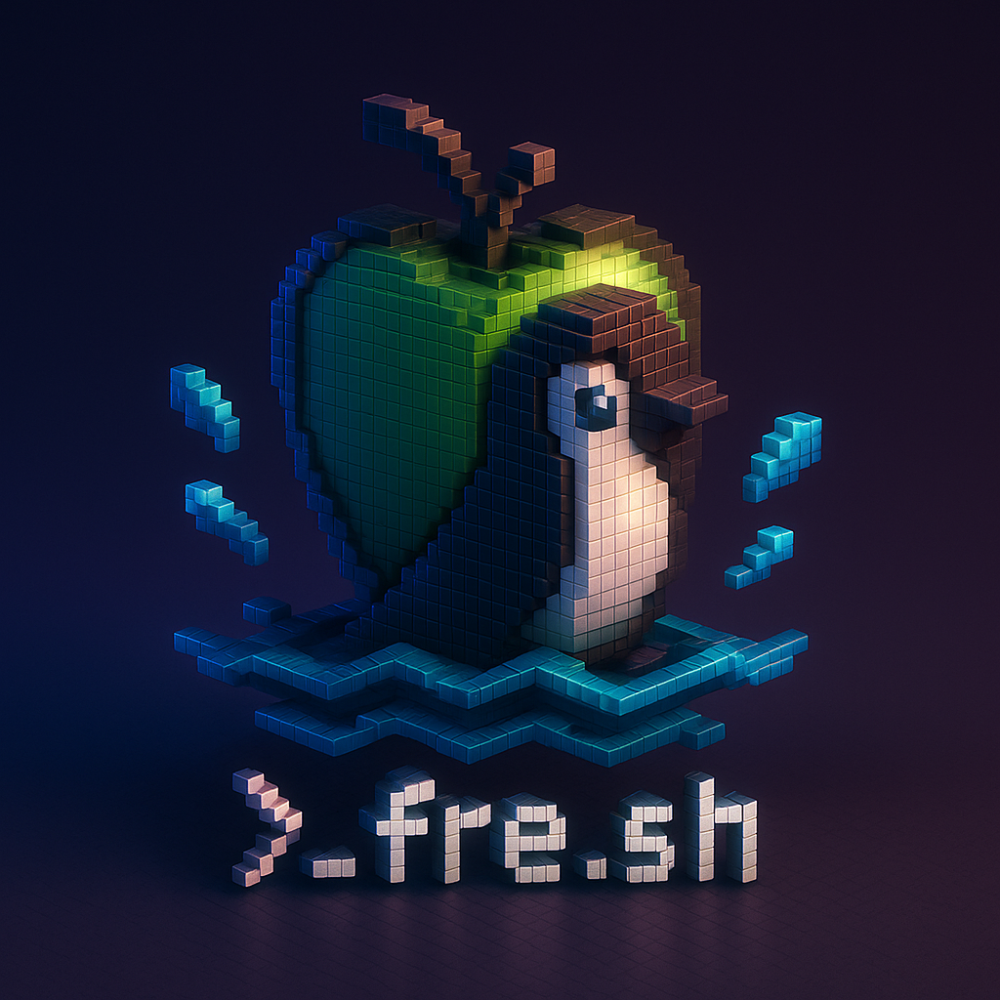

# fre.sh
<p align="center">      </p>

> **fre.sh** is a script designed to **fresh install** your developer environment on **macOS** and **Linux** (initially **Debian**). It automates installing **Homebrew**, essential **apps** (via **casks**), setting up **aliases**, configuring **Neovim**, managing **dotfiles** (with **stow**), and customizing your **command prompt** — all in a clean and simple way.


---

## ✨ Features

- 🛠️ Fresh installation of [Homebrew](https://brew.sh/)
- 📦 Install applications via Homebrew casks
- 📝 Configure aliases and shell environment
- 🧐 Setup and configure [Neovim](https://neovim.io/)
- 🗂️ Manage dotfiles using [GNU Stow](https://www.gnu.org/software/stow/)
- 💬 Customize your command prompt
- 🎯 Supports **macOS** and **Debian-based Linux distributions**
- 🔀 Status spinner and colored feedback for better UX
- 🕵️ Debug mode for troubleshooting

---

## 📅 Installation

Clone this repository:

```bash
git clone https://github.com/your-username/fre.sh.git
cd fre.sh
```

---

## 🚀 Usage

Run the script with the command you want to execute:

```bash
./fre.sh "your-command-here"
```

For example:

```bash
./fre.sh "./setup.sh"
```

The script will open a new terminal window (or tab) and run the command with a spinner animation and status updates.

---

## ⚙️ How it Works

- **macOS:** Uses AppleScript to open a new Terminal window and execute the command.
- **Linux:** Supports `gnome-terminal` and `xterm` to spawn a new terminal window.
- **Error Handling:** Displays success (`✓`) or error (`✗`) messages based on the command's exit status.
- **Temporary Files:** Manages temporary files to track command success or failure.

---

## 👍 Requirements

- **macOS** or **Debian-based Linux**
- Installed terminal emulator:
  - `Terminal.app` (macOS) - default
  - `gnome-terminal` or `xterm` (Linux)
- Basic packages:
  - `bash`
  - `stow` (for dotfiles)
  - `Homebrew` (installed automatically if missing)

---

## 🔍 Debug Mode

To enable debug mode and trace the script's execution:

Edit the script and set:

```bash
DEBUG=1
```

This will print each command before execution with its file and line number.

---

## 📄 License

MIT License. See [LICENSE](LICENSE) for details.

---

## 🧑‍📚 Future Improvements

- Expand support for more Linux distributions.
- Add automatic Neovim plugin manager setup (e.g., Lazy.nvim).
- Detect and install missing dependencies.
- Add zsh shell support.

---

## 🤝 Contributing

Contributions, issues, and feature requests are welcome!Feel free to check the [issues page](https://github.com/your-username/fre.sh/issues).

---

## ✨ Author

Made with ❤️ by [bspinheiro](https://github.com/bspinheiro)

<p align="center">
  
</p>

